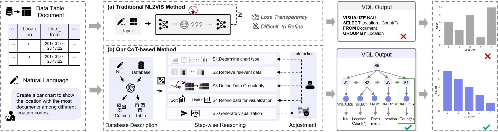

# DeepVIS
Despite data visualization's power in uncovering patterns and sharing insights, crafting effective visuals demands knowledge of authoring tools and can disrupt the analysis process. Although large language models hold potential for auto-converting analysis intent into visualizations, current methods operate as black boxes lacking transparent reasoning, hindering users from grasping design rationales and improving subpar outputs.

To address this issue, first, we propose a Chain-of-Thought (COT) data construction process. We design a comprehensive CoT reasoning process for Natural-Language-to-Visualization (NL2VIS) and develop an automated pipeline to endow existing datasets with structured reasoning steps. Second, we introduce **CoT-nvBench**, a specialized dataset that records detailed step-by-step reasoning from ambiguous natural language descriptions to final visualizations. Finally, we propose **DeepVIS**, an interactive visual interface that is deeply integrated with the CoT reasoning process. It enables users to inspect reasoning steps, correct errors, and optimize visualization results.

